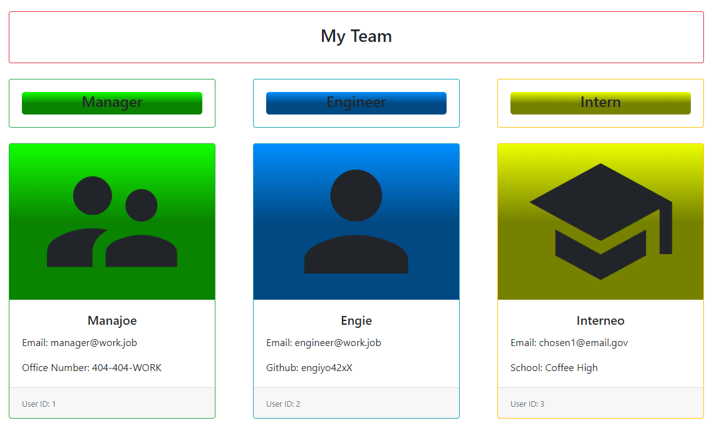

# [TeamPageGenerator](https://github.com/TheMatthewSawyer/TeamPageGenerator)
### HTML Page generator for information entered.

## Getting Started

This project runs with node and has several dependencies. To run:

* Ensure node is installed.

* Using git bash, VSC, or any other terminal, navigate to the directory.

* Enter 'node app.js'

## Testing

Tests are included and can be run through jest:

* Open Visual Studio Code

* Open project folder in terminal

* Enter 'npm test'

## Built with

1. Microsoft Visual Studio Code
    1. https://code.visualstudio.com/
2. Bootstrap
    1. https://getbootstrap.com/
3. NPM
    1. https://www.npmjs.com/
4. Material Icons
    1. https://material.io/resources/icons/?style=baseline
5. GitHub (Where you are now :grin:)
    1. https://github.com/
